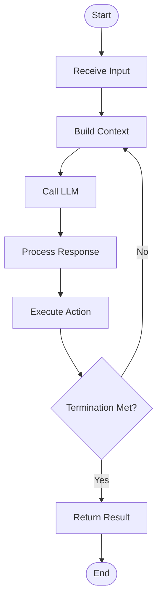

# AI Agent Framework Capability Differentiation: A Deep Code Audit

**[中文版本](BLOG.zh.md)** | English

---

> **TL;DR**: After auditing ~300KB of source code from 12 mainstream agent frameworks ([OpenAI Agents SDK](deep-dive/OpenAI-Agents-SDK-DEEP-DIVE.md), [Claude Agent SDK](deep-dive/Claude-Agent-SDK-Python-DEEP-DIVE.md), [Codex CLI](deep-dive/Codex-CLI-DEEP-DIVE.md), [OpenCode](deep-dive/OpenCode-DEEP-DIVE.md), [Kimi CLI](deep-dive/Kimi-CLI-DEEP-DIVE.md), [Gemini CLI](deep-dive/Gemini-CLI-DEEP-DIVE.md), [Qwen Code](deep-dive/Qwen-Code-DEEP-DIVE.md), [SWE-agent](deep-dive/SWE-agent-DEEP-DIVE.md), [OpenManus](deep-dive/OpenManus-DEEP-DIVE.md), [Aider](deep-dive/Aider-DEEP-DIVE.md), [Goose](deep-dive/Goose-DEEP-DIVE.md), [OpenHands](deep-dive/OpenHands-DEEP-DIVE.md)), we discovered a counter-intuitive fact: **The core Agent Loop logic is highly similar across frameworks**. The real differences lie not in "which algorithm is used," but in **engineering capability combinations**—30+ features including state management, security controls, and protocol support. This "capability differentiation" creates an invisible gap, making it difficult for academia to leverage the most advanced agent capabilities.
>
> **Stars Ranking** (as of 2026-02-27): OpenCode (112K) > Gemini CLI (95.9K) > Claude Code (70.8K) > OpenHands (68.3K) > Codex CLI (62.2K) > Aider (41K) > Goose (31.4K) > OpenAI Agents SDK (19.2K)

> **Navigation**:
> - Sections 1-3: Code audit observations (facts)
> - Section 4: Specific manifestations of academic vs. industrial capability requirements (facts + inference)
> - Section 5: Future convergence trends (author's judgment)
> - Section 6: Framework selection and practice recommendations (actionable)
> - [Detailed Framework Comparison Matrix](COMPARISON.md)
> - [In-depth Source Code Analysis](deep-dive/)

---

## I. Debunking Myths: The Agent Core Loop is Highly Stable

> **Important Scope**: This article focuses on the **Single-Agent Tool-Calling Pattern**, which is the mainstream architecture across the 12 open-source frameworks surveyed. Multi-Agent orchestration (e.g., Planning, inter-agent communication), Planner-Executor separation, and other paradigms are outside the scope of this discussion.

### 1.1 Twelve Frameworks, One Loop

Based on deep code audits of 12 frameworks, a counter-intuitive fact emerges: **Despite vast differences in implementation languages, design philosophies, and application scenarios, all frameworks follow a highly similar paradigm for their core control flow (Agent Loop)**. This similarity is so stable that it can be traced back to the basic structure presented in the 2022 ReAct paper.

This section categorizes the 12 frameworks into **4 architectural patterns**, demonstrating how they implement differentiation on top of the same underlying logic.

---

#### Pattern 1: Standard Synchronous Loop

**Representative Frameworks**: OpenAI Agents SDK, SWE-agent, OpenManus, Aider

This is the most classic and intuitive implementation approach. A `while` loop continues running until termination conditions are met.

**OpenAI Agents SDK** (Python, 600+ lines production-grade implementation):
```python
# src/agents/run.py:637 (actual source location)
while True:
    # Complex 600+ line loop with state recovery, guardrails, handoffs
    turn_result = await run_single_turn(agent, tools, ...)
    if isinstance(turn_result.next_step, NextStepFinalOutput):
        break
    # Handle handoffs, tool execution, etc.
```
*See [GitHub source](https://github.com/openai/openai-agents-python/blob/main/src/agents/run.py)*

**SWE-agent** (Python, research-oriented):
```python
# sweagent/agent/agents.py:350 (actual source location)
while not step_output.done:
    step_output = self.step()
    if step_output.done:
        self._rloop.on_submit(...)
```
*See [GitHub source](https://github.com/SWE-agent/SWE-agent/blob/main/sweagent/agent/agents.py)*

**OpenManus** (Python, lightweight experimental framework):
```python
# app/agent/base.py:116-154 (actual source location)
async def run(self, request: Optional[str] = None) -> str:
    async with self.state_context(AgentState.RUNNING):
        while (self.current_step < self.max_steps and 
               self.state != AgentState.FINISHED):
            self.current_step += 1
            step_result = await self.step()
            if self.is_stuck():
                self.handle_stuck_state()
```
*See [GitHub source](https://github.com/FoundationAgents/OpenManus/blob/main/app/agent/base.py)*

**Aider** (Python, conversational coding assistant):
```python
# aider/coders/base_coder.py:876 (actual source location)
while True:
    user_message = self.get_input()
    self.run_one(user_message)
```
*See [GitHub source](https://github.com/Aider-AI/aider/blob/main/aider/coders/base_coder.py)*

**Common Characteristics**: Explicit `while` loop, synchronous/asynchronous single-threaded execution, direct state management.

---

#### Pattern 2: Asynchronous Event-Driven

**Representative Framework**: OpenHands

OpenHands adopts a completely different architectural philosophy: **no explicit loop, only event streams**.

```python
# openhands/controller/agent_controller.py (core logic)
class AgentController:
    async def _step(self) -> None:
        """Single step execution, driven by EventStream"""
        action = self.agent.step(self.state)
        if action is None:
            return
        await self.event_stream.add_event(action, ...)
        
    async def on_event(self, event: Event) -> None:
        """Event callback triggers next step"""
        if event.source == EventSource.AGENT:
            await self._step()
```

**Architectural Features**:
- **EventStream**: All state changes propagate through event streams
- **Callback-driven**: No `while True` needed; events naturally trigger next steps
- **Loose coupling**: Agent, Runtime, and Controller interact through events rather than direct calls

*See [GitHub source](https://github.com/All-Hands-AI/OpenHands/blob/main/openhands/controller/agent_controller.py)*

---

#### Pattern 3: Three-Layer Actor Model

**Representative Framework**: Codex CLI

Codex CLI uses Rust's Actor model to implement a **three-layer nested loop**, managing complexity through layered separation:

**Layer 1: Submission Loop** - Message dispatch center
```rust
// codex-rs/core/src/codex.rs:3685-3855
async fn submission_loop(sess: Arc<Session>, ...) {
    while let Ok(sub) = rx_sub.recv().await {
        match sub.op {
            Op::UserInput { ... } => handlers::user_input_or_turn(...).await,
            Op::ExecApproval { ... } => handlers::exec_approval(...).await,
            Op::Interrupt => handlers::interrupt(...).await,
            Op::Shutdown => break,
        }
    }
}
```

**Layer 3: Sampling Loop** - LLM streaming processing
```rust
// codex-rs/core/src/codex.rs:6220-6554
async fn try_run_sampling_request(...) {
    let mut stream = client_session.stream(prompt, ...).await?;
    let mut in_flight: FuturesOrdered<...> = FuturesOrdered::new();
    
    loop {
        match stream.next().await {
            ResponseEvent::OutputItemDone(item) => {
                if let Some(tool_future) = output_result.tool_future {
                    in_flight.push_back(tool_future);  // Parallel execution
                }
            }
            ResponseEvent::Completed { ... } => break,
        }
    }
}
```

**Design Philosophy**:
- **Separation of concerns**: User interaction, turn management, and LLM calls are layered
- **High concurrency**: Rust's `FuturesOrdered` supports parallel tool execution
- **Interruptible**: Each layer can independently handle interrupt signals

*See [GitHub source](https://github.com/openai/codex) | [Deep Dive](deep-dive/Codex-CLI-DEEP-DIVE.md)*

---

#### Pattern 4: Enhanced Loop with Capabilities

**Representative Frameworks**: OpenCode, Kimi CLI, Gemini CLI, Qwen Code, Goose

These frameworks embed specific engineering capabilities into the standard loop, manifested as checkpoints and processing logic within the code.

**OpenCode** (context compaction and permission checks):
```typescript
// packages/opencode/src/session/prompt.ts:347-738
export async function loop(sessionID: string, options?: LoopOptions) {
  let step = 0
  while (true) {
    // Filter compacted messages
    let msgs = await MessageV2.filterCompacted(MessageV2.stream(sessionID))
    
    // Check context overflow
    if (await SessionCompaction.isOverflow({ tokens: lastFinished.tokens })) {
      await SessionCompaction.create({ sessionID, auto: true })
      continue
    }
    
    // Normal processing
    const result = await processor.process({ user: lastUser, tools, model })
    if (result === "stop") break
  }
}
```

**Kimi CLI** (D-Mail time travel mechanism):
```python
# src/kimi_cli/soul/kimisoul.py:206-275
async def _agent_loop(self) -> TurnOutcome:
    step_no = 0
    while True:
        step_no += 1
        if step_no > self._loop_control.max_steps_per_turn:
            raise MaxStepsReached(...)
        
        # Create checkpoint
        await self._checkpoint()
        
        try:
            step_outcome = await self._step()
        except BackToTheFuture as e:  # Time travel exception
            await self._context.revert_to(e.checkpoint_id)
            await self._context.append_message(e.messages)
            continue
```

**Gemini CLI** (auto-continue and loop detection):
```typescript
// packages/core/src/core/client.ts:360-450
async *sendMessageStream(request, signal, prompt_id, turns): AsyncGenerator<...> {
  // Loop detection
  if (this.loopDetector.addAndCheck(event)) {
    yield { type: GeminiEventType.LoopDetected }
    return
  }
  
  // Auto continue
  if (!turn.pendingToolCalls.length) {
    const nextSpeakerCheck = await checkNextSpeaker(...)
    if (nextSpeakerCheck?.next_speaker === 'model') {
      const nextRequest = [{ text: 'Please continue.' }]
      yield* this.sendMessageStream(nextRequest, signal, prompt_id, boundedTurns - 1)
    }
  }
}
```

**Qwen Code** (SubAgents nesting):
```typescript
// packages/core/src/core/client.ts:261-384
async *sendMessageStream(request, signal, prompt_id, options): AsyncGenerator<...> {
  // SubAgents system reminders
  const systemReminders = []
  if (hasTaskTool && subagents.length > 0) {
    systemReminders.push(getSubagentSystemReminder(subagents))
  }
  
  // Recursive call for auto-continue
  if (nextSpeakerCheck?.next_speaker === 'model') {
    yield* this.sendMessageStream([{ text: 'Please continue.' }], ...)
  }
}
```

**Goose** (MCP-Native streaming):
```rust
// crates/goose/src/agents/agent.rs:575-700+
async fn reply_internal(...) -> Result<BoxStream<'_, Result<AgentEvent>>> {
    Ok(Box::pin(async_stream::try_stream! {
        loop {
            // MOIM injection
            let conversation_with_moim = super::moim::inject_moim(...).await
            
            // Stream response from LLM provider
            let mut stream = Self::stream_response_from_provider(...).await?
            
            while let Some(next) = stream.next().await {
                // Process messages, tool calls, etc.
            }
        }
    }))
}
```

**Common Characteristics**:
- Standard `while` loop skeleton
- Embedded engineering capability checks at key nodes (compaction, permissions, loop detection, etc.)
- Streaming processing becomes standard

---

#### Unified View: The Essence of Agent Loop

Regardless of architectural pattern, they all implement the same **abstract control flow**:



**Core Abstraction**:
1. **Receive Input** → User request, system event, or feedback from previous iteration
2. **Build Context** → Assemble history, tool definitions, system state
3. **Call LLM** → Interact with language model (single-turn or streaming)
4. **Process Response** → Parse, validate, transform LLM output
5. **Execute Action** → May include: tool invocation, state modification, reply generation, handoff trigger, etc.
6. **Termination Check** → Loop continues until any termination condition is met:
   - LLM returns final answer (no further actions)
   - Maximum iteration limit reached
   - User explicitly interrupts
   - Error or exception encountered
   - Task completion flag set

**Key Insight**: In actual implementations, steps 4-6 may involve complex internal logic (parallel tools, state checks, security validations), but macroscopically they are all variations of this loop structure.

**Key Insights**:
1. **Highly stable algorithm layer**: ReAct, Function Calling, and Tool Use all share this loop
2. **Differences in engineering implementation**: State management, security checks, streaming, compaction strategies
3. **Architecture choices reflect scenarios**: Research prioritizes simplicity and interpretability; production prioritizes robustness and scalability

This is the **Agent Loop**—**the essential logic has remained highly stable** since the publication of the 2022 ReAct paper.

### 1.2 So, Where Do the Differences Lie?

If the core loop is the same, why do these frameworks feel so different in actual use?

The answer is: **Capability combinations**.

Like an operating system, everyone uses Linux for the kernel (Loop), but the differences between distributions (frameworks) lie in:
- Which package manager? (Tool system)
- Which desktop environment? (UI/interaction mode)
- Which security mechanism? (Permission controls)
- Which file system? (State management)

Agent frameworks are the same. The core loop is the "kernel," while **capabilities** are "distribution customizations."

---

## II. The Four-Layer Capability Differentiation

Based on the code audit, I've categorized Agent framework differences into a **four-layer capability system**:

### Layer 1: Core Loop - Same Across All Frameworks

This is the **invisible infrastructure**. Regardless of which framework you use, you're working with the same logic:
- Maintain message history
- Call LLM
- Parse output
- Execute tools
- Repeat until completion

**Key Conclusion**: When choosing a framework, **don't be misled by "which algorithm is used."** All frameworks support ReAct, Function Calling, and even Tree-of-Thoughts (just different prompts).

### Layer 2: Engineering Capabilities - Differentiated Competition

This is the layer that **truly affects user experience**. Based on the code audit, I've grouped key engineering capabilities into **5 core dimensions**:

#### 2.1 State Management Capabilities

**Capability: Session Persistence**

| Framework | Implementation | Code Location |
|-----------|---------------|---------------|
| **OpenAI Agents SDK** | SQLite / Redis / Custom (Protocol-based) | `src/agents/memory/session.py:14-55` |
| **OpenCode** | SQLite (Drizzle ORM) | `src/storage/database.ts` |
| **Codex CLI** | JSONL files + SQLite metadata | `codex-rs/core/src/state_db.rs` |
| **Kimi CLI** | JSONL files | `src/session.py:context_file` |
| **SWE-agent** | Trajectory files only (research-oriented) | `trajectory.jsonl` |
| **OpenManus** | ❌ None (In-memory only) | - |

**Why it matters**: Production environments must support conversation history persistence. If an Agent crashes, users expect to resume the conversation, not start over.

**Academic Dilemma**: SWE-agent and OpenManus lack general production-grade Session management (SWE-agent focuses on trajectory persistence), making research code difficult to deploy directly in production.

---

**Capability: State Serialization and HITL (Human-in-the-Loop)**

This is the **hallmark of production-grade frameworks**.

**OpenAI Agents SDK** implementation (most complete):
```python
# src/agents/run_state.py:2384 lines
class RunState(Generic[TContext]):
    """Serializable run state supporting interruption and resumption"""
    input: list[TResponseInputItem]
    output: list[RunItem]
    _current_step: NextStep  # Current execution step
    _last_processed_response: ProcessedResponse
    
    def approve(self, interruption: Interruption) -> None:
        """Resume after human approval"""
        
    def to_state_dict(self) -> dict:
        """Serialize to JSON for storage/restoration"""
```

**Usage Scenarios**:
1. Agent proposes executing `rm -rf /`, system pauses for human confirmation
2. User reviews and chooses "Reject" or "Execute with modifications"
3. Resume from the pause point without rerunning

**Adoption Rate**: Currently, only OpenAI SDK provides complete built-in support. Claude SDK can partially implement via Hooks; other frameworks mostly require custom implementation.

---

**Capability: Context Compaction**

**OpenCode** representative implementation:
```typescript
// src/session/prompt.ts:274-724
if (await SessionCompaction.isOverflow(sessionID)) {
    // Auto-trigger compaction
    await SessionCompaction.create({
        sessionID,
        reason: "token_limit_approaching"
    });
    continue;  // Re-loop with compacted context
}
```

**Why it matters**: Long-context LLMs (like Gemini 1M tokens) exist, but cost remains a concern. OpenCode's Smart Compaction helps reduce token consumption in long-session scenarios (specific benefits depend on task and configuration).

**Academic Dilemma**: Academia typically uses short conversations (< 10 turns), with lower compaction needs; but production long conversations (> 50 turns) often require this capability more.

---

#### 2.2 Security Control Capabilities

This is the **core differentiation point for enterprise frameworks**. Five security models coexist:

**Model 1: No Security**
- **OpenManus**: Relies on runtime environment security
- **Applicable scenarios**: Controlled academic research environments

**Model 2: Guardrails**
- **OpenAI Agents SDK**:
```python
@input_guardrail
async def check_pii(context, input_items):
    """Check for personally identifiable information"""
    
@output_guardrail  
async def check_sensitive_output(context, output):
    """Check if output is sensitive"""

@tool_guardrail
def dangerous_tool_guardrail(context, tool_call):
    """Check if tool call is dangerous"""
```

- **Characteristics**: Three-layer protection (input/output/tools), Python decorator implementation
- **Limitations**: Pure software layer, cannot block underlying system calls

---

**Model 3: Hooks**
- **Claude Agent SDK** (representative implementation):
```python
# 10+ hook events
hooks = {
    "PreToolUse": [check_safety],           # Before tool execution
    "PostToolUse": [log_result],            # After tool execution
    "UserPromptSubmit": [check_prompt],     # When user submits
    "SubagentStart": [init_subagent],       # Subagent startup
    "SubagentStop": [cleanup_subagent],     # Subagent stop
    # ... more
}
```

- **Characteristics**: Ultimate flexibility, can intervene at any step
- **Cost**: Requires deep developer involvement, high learning curve

---

**Model 4: Policy Engine**
- **OpenCode** (Wildcard Pattern):
```json
{
  "permission": {
    "bash": {
      "rm *": "deny",
      "rm -rf /": "deny",
      "*": "ask"
    }
  }
}
```

- **Gemini CLI** (TOML Policy):
```toml
[policy]
approval_mode = "manual"
trusted_folders = ["/home/user/safe"]

[[policy.rules]]
tool = "shell"
pattern = "sudo *"
action = "deny"
```

- **Characteristics**: Declarative configuration, Last Match Wins
- **Advantages**: Non-developers can understand and modify

---

**Model 5: Sandbox Isolation**
- **Codex CLI** (representative implementation):
```rust
// codex-rs/core/src/seatbelt.rs (macOS)
// codex-rs/core/src/landlock.rs (Linux)  
// codex-rs/core/src/windows_sandbox.rs (Windows)

pub struct SandboxPolicy {
    pub policy_type: PolicyType,
    pub writable_roots: Vec<PathBuf>,  # Whitelist of writable directories
    pub network_access: bool,          # Network access control
}

// Three-layer security
1. Platform Sandbox (OS-level process isolation)
2. Approval Policy (.rules file, command-level control)
3. Network Control (protocol/host/port-level control)
```

- **Characteristics**: Provides the most complete OS-level isolation capability among surveyed frameworks
- **Cost**: Rust implementation, complex configuration, performance overhead

---

**Security Capability Summary**:

| Security Level | Representative Framework | Applicable Scenarios | Intrusiveness |
|---------------|-------------------------|---------------------|---------------|
| Level 0 | OpenManus | Academic research | None |
| Level 1 | OpenAI SDK | General applications | Low (decorators) |
| Level 2 | Claude SDK | Needs flexible control | Medium (Hooks) |
| Level 3 | OpenCode, Gemini | Configurable policies | Low (config files) |
| Level 4 | Codex CLI | Enterprise/Finance/Healthcare | High (Sandbox) |

**Academic Dilemma**: Academia typically uses Level 0-1, but industry (especially finance, healthcare) needs Level 3-4. This makes academic code difficult to deploy directly.

---

#### 2.3 Tool System Capabilities

**Capability: MCP (Model Context Protocol) Support Depth**

| Depth Level | Framework | Implementation |
|------------|-----------|---------------|
| **Level 0** | SWE-agent | ❌ Not supported |
| **Level 1** | OpenAI SDK | ⚠️ Can connect to external MCP via tools |
| **Level 2** | OpenCode, Kimi, Gemini, Qwen | ✅ MCP Client (connects to external servers) |
| **Level 3** | OpenManus | ✅ MCP Client + Server (FastMCP) |
| **Level 4** | Claude SDK | ✅✅✅ SDK MCP (In-Process, zero overhead) |
| **Level 5** | Codex CLI | ✅✅✅✅ Dual roles (Client + Server) |

**Claude SDK's SDK MCP** (innovative):
```python
# Run MCP server in Python process, no subprocess needed
@tool("fibonacci", "Calculate fibonacci", {"n": int})
async def fibonacci(args):
    return {"content": [{"type": "text", "text": f"fib({args['n']})"}]}

server = create_sdk_mcp_server("math-tools", tools=[fibonacci])
```

**Why it matters**: Traditional MCP often requires launching subprocesses (npx, python, etc.), which brings additional startup and communication overhead. Claude's SDK MCP runs directly in-process, significantly reducing this overhead.

---

**Capability: Parallel Tool Execution**

**OpenAI Agents SDK**:
```python
# Automatic parallelization (asyncio.gather)
await asyncio.gather(
    *[execute_tool(tc) for tc in response.tool_calls]
)
```

**SWE-agent/OpenManus**:
```python
# Sequential execution
for tool_call in response.tool_calls:  # Execute one by one
    result = execute_tool(tool_call)
```

**Performance difference**: If an Agent needs to "query weather, check calendar, search email" simultaneously, parallel execution is 2-3x faster.

**Academic Dilemma**: Academic research typically uses sequential execution (easier to analyze execution order), but production environments often need parallel execution more.

---

#### 2.4 Observability Capabilities

**Capability: Structured Tracing**

**OpenAI Agents SDK** (most complete):
```python
# 6 Span types
AgentSpan        # Agent execution
GenerationSpan   # LLM call
FunctionSpan     # Tool call
HandoffSpan      # Agent handoff
GuardrailSpan    # Security check
CustomSpan       # Custom

# Export to 6+ platforms
set_trace_processors([
    LogfireProcessor(),      # Logfire
    AgentOpsProcessor(),     # AgentOps
    BraintrustProcessor(),   # Braintrust
    # ...
])
```

**Why it matters**: You can't improve what you can't measure. Production environments typically need to know:
- How much did each LLM call cost?
- Which tool is the slowest?
- Why is the Agent stuck in a loop?

**Adoption Rate**: Only OpenAI SDK provides relatively complete built-in structured Tracing; other frameworks mostly have experimental telemetry, hooks, or basic logging.

**Academic Dilemma**: Academia uses Trajectory files (SWE-agent), but those are for humans to read, not for machine analysis.

---

#### 2.5 Project Context Capabilities

**Capability: Project Memory Files**

**Emerging Standards**: `CLAUDE.md`, `AGENTS.md`, `GEMINI.md`

**Gemini CLI Implementation**:
```markdown
# GEMINI.md - Project-level Agent Configuration

## Project Overview
This is a Python Web application using FastAPI framework.

## Coding Standards
- Follow PEP 8 style
- All functions must include type annotations
- Async functions use async/await

## Common Commands
- Run tests: `pytest tests/`
- Start server: `uvicorn main:app --reload`
- Code check: `ruff check .`

## Key Files
- `app/models.py` - Data model definitions
- `app/routers/` - API routes
- `tests/conftest.py` - Test configuration
```

**Why it matters**:
- **Knowledge persistence**: Transfer project knowledge from human brain to files
- **Cross-session memory**: Agent can read project context after restart
- **Team collaboration**: Team members share the same Agent configuration

**Adoption Status**:
- **Claude Code**: `CLAUDE.md`
- **OpenCode**: `AGENTS.md`
- **Gemini CLI**: `GEMINI.md`
- **Codex CLI**: `AGENTS.md`
- **Warp**: Reads all memory files (`CLAUDE.md`, `AGENTS.md`, `GEMINI.md`)

**Warp's Innovation**: Automatically detects and reads all mainstream memory files, achieving "if you switch Agents, it automatically understands your project."

---

### Layer 3: Protocol Support - Ecosystem Compatibility

This layer isn't determined by individual frameworks, but by **industry standards**.

#### 3.1 MCP (Model Context Protocol)

**What is MCP**

MCP (Model Context Protocol) is an open protocol standard proposed by Anthropic in November 2024, designed to establish unified specifications for communication between AI Agents and external tools/data sources. Its design philosophy is similar to the **USB interface** in computer hardware—standardized connectors, plug and play.

**Core Architecture**:
```
┌─────────────┐          ┌─────────────┐          ┌─────────────┐
│   Host      │◄────────►│   Client    │◄────────►│   Server    │
│  (Agent)    │  stdio   │  (Transport)│  MCP Protocol│  (Tools)    │
└─────────────┘          └─────────────┘          └─────────────┘
```

**Design Principles**:
1. **Transport agnostic**: Supports stdio, HTTP, WebSocket, and other transport layers
2. **Capability negotiation**: Client and Server dynamically negotiate supported features (tools/resources/prompts)
3. **Bidirectional communication**: Not just Tool Call, but also Resource subscriptions, Prompt templates, etc.
4. **Type safety**: Based on JSON-RPC 2.0, strict schema definitions

**Ecosystem Status** (as of 2026-02):

| Dimension | Data |
|-----------|------|
| **Official Server Count** | 30+ (GitHub, Slack, PostgreSQL, Puppeteer, etc.) |
| **Community Servers** | 1000+ (mcp.so and other third-party registries) |
| **Framework Support Rate** | 11/12 (only SWE-agent doesn't support) |
| **IDE Integration** | Claude Desktop, Cursor, Zed, VS Code, etc. |

**Deep Differences Analysis**:

Different frameworks have significant differences in MCP support depth (see Section 2.3 table):

- **Level 1-2 (Client-only)**: OpenCode, Gemini, Kimi, etc. launch MCP Servers via external processes, communicating through stdio/SSE
- **Level 3 (Client + Server)**: OpenManus, Codex can both connect to external MCP Servers and expose MCP interfaces themselves
- **Level 4 (SDK MCP)**: Claude SDK's unique innovation—run MCP Server directly in Python process, eliminating subprocess overhead
- **Level 5 (MCP-Native)**: Goose abstracts all tools as MCP, calling through unified interface, achieving true tool-agnostic architecture

**Why MCP Matters**

1. **Breaking tool silos**: Previously each framework had its own tool format (OpenAI Function, LangChain Tool, Google Tool), now unified to MCP
2. **Ecosystem network effects**: Developers write one MCP Server, all supported frameworks can use it
3. **Reduced migration costs**: Enterprises can wrap internal APIs as MCP Servers and seamlessly switch between different Agent frameworks
4. **Academic reproducibility**: After benchmark tools are MCP-ized, different frameworks can be fairly compared under the same conditions

**Academic Opportunity**: Encapsulate evaluation tool sandbox environments like SWE-Bench and HumanEval as MCP Servers, allowing industrial-grade frameworks (OpenAI SDK, Codex) to also evaluate in standard environments, eliminating "my framework is better than yours" incomparable conclusions.

**MCP Limitations and Alternatives**

> This section is based on industry practice observations, particularly the in-depth analysis from the [Lynxe author’s series of articles](https://mp.weixin.qq.com/s/dAnNHayrE49FEl8TcLII2Q) (2025).

Although MCP provides a standardized protocol layer, in practice it is not the only choice and may even have lighter-weight alternatives:

**1. Limitations of MCP**
- **Protocol conversion overhead**: MCP requires JSON-RPC protocol conversion between Client and Server, which may be "over-engineered" for simple tool calls.
- **Ecosystem dependency**: Although standardization reduces single integration costs, it still requires maintaining the MCP Server runtime (Node.js/Python processes).
- **Learning curve**: Developing an MCP Server requires understanding protocol specifications; the barrier remains high for scenarios where one simply wants to quickly expose a shell script.

**2. Alternatives: Direct Function/Command Line Calls**
In fact, the core requirement for tool integration is very simple: **function name + parameters + description**. Based on this premise, multiple lightweight alternatives have emerged in the industry:

- **Direct command line calls**: Invoke local scripts or remote APIs directly via `bash` or `curl`, without additional MCP Server encapsulation.
- **Function interfaces (Func-Agent)**: As practiced by the [Lynxe](https://github.com/spring-ai-alibaba/Lynxe) framework, exposing Agent capabilities directly as function interfaces, allowing existing systems to use Agents through standard function calls.
- **Skill files (Skills)**: Proposed by Claude, describing tool usage workflows via SKILL.md documents, combined with Function Calling to directly execute shell commands.

**3. Comparison of Approaches**

| Dimension | MCP | Direct Function/CLI | Skills |
|-----------|-----|---------------------|--------|
| **Complexity** | Requires implementing MCP Server | No additional protocol layer | Requires writing SKILL.md |
| **Applicable Scenarios** | Standardized tools for cross-framework reuse | Quick integration with existing systems | Text-based description of complex workflows |
| **Flexibility** | Limited by protocol specifications | Complete freedom | Dependent on model understanding documents |
| **Ecosystem Compatibility** | All frameworks supporting MCP | Separate integration required for each framework | Limited to clients supporting Skills |

**Key Insight**: MCP and direct function calls are not opposing, but solutions to **different problems**. MCP suits tools requiring **broad reuse** (e.g., GitHub, Slack integrations), while direct function calls are better for **quickly integrating internal systems**. The future likely holds a hybrid model where both coexist.

---

#### 3.2 ACP (Agent Client Protocol)

**What is ACP**

ACP (Agent Client Protocol) is a protocol standard proposed by Moonshot AI (Kimi) in 2024, focused on solving the **standardization of communication between Agents and IDEs**. If MCP solves "how Agents call tools," ACP solves "how IDEs control Agents."

**Core Capabilities**:
- **Session management**: Create, resume, and persist Agent sessions
- **Message transport**: Standardized user input and Agent output formats
- **Tool coordination**: Synchronize tool definitions and execution results between IDE and Agent
- **Context passing**: Pass editor state (cursor position, selected code) to Agent

**Current Support Status**:
- **Kimi CLI**: Most complete ACP Server implementation, supports ACP 1.0 specification
- **OpenCode**: Partial ACP support, mainly used for IDE plugin communication
- **IDE side**: VS Code, JetBrains access through plugins (still evolving)

**Relationship with MCP**:
```
┌──────────────────────────────────────────────────────────────┐
│                      IDE (VS Code/Zed)                       │
└─────────────┬────────────────────────────────┬───────────────┘
              │ ACP (Agent Control Protocol)    │ MCP (Tool Protocol)
              ▼                                ▼
┌──────────────────────┐              ┌──────────────────────┐
│    Kimi/OpenCode     │              │   External Tools     │
│     (Agent Host)     │─────────────►│   (MCP Servers)      │
└──────────────────────┘              └──────────────────────┘
```

ACP and MCP are **complementary**: ACP manages "human-Agent interaction," MCP manages "Agent-tool interaction."

---

#### 3.3 Strategic Significance of Protocol Layer: Ecosystem Lock-in vs Openness

**Why Protocols Matter More Than APIs**

In software engineering, **protocols have stronger lock-in effects than APIs**:
- APIs can be imitated, encapsulated, adapted
- Once protocols are adopted by the ecosystem, network effects form, making them difficult to replace

**Historical Analogies**:
- HTTP/TCP: Internet infrastructure, unchanged for 30 years
- SQL: Database query standard, supported by all databases
- USB: Hardware interface standard, unified peripheral world

**MCP's Potential Impact**:

| Aspect | Short-term (1-2 years) | Medium-term (3-5 years) | Long-term (5+ years) |
|--------|------------------------|-------------------------|---------------------|
| **Tool Ecosystem** | Official + Community Server explosion | Mainstream SaaS all provide MCP | MCP becomes default integration method |
| **Framework Competition** | Support depth is differentiation point | Basic Client becomes standard | MCP-Native architecture wins |
| **Academic Impact** | Benchmark MCP-ization proposals | Standardized evaluation environments | Paper reproducibility greatly improved |
| **Business Landscape** | Anthropic leads | OpenAI follows | Decentralized tool market |

**Key Insights**:

1. **Protocol standardization is unstoppable**: Agent ecosystem needs interoperability, closed protocols will eventually be replaced by open standards
2. **First-mover advantage is significant**: Anthropic promotes MCP, other vendors (OpenAI, Google) have followed to support
3. **Blessing for tool vendors**: Write one MCP Server, connect to all Agent frameworks, ROI far higher than adapting to each framework's private API
4. **Reduced enterprise migration costs**: After internal tools are MCP-ized, Agent frameworks can be freely replaced, avoiding vendor lock-in

**Implications for Framework Selection**:
- Prioritize frameworks with comprehensive MCP support (Level 3+), ensuring tool ecosystem compatibility
- Pay attention to framework's MCP Server capabilities (can it expose Agent capabilities externally)
- When building custom tools, directly implement MCP Server rather than private API

---

### Layer 4: Interaction Mode - The Surface Layer

This is what **users directly perceive**:

| Mode | Framework | Applicable Scenarios |
|------|-----------|---------------------|
| **Python SDK** | OpenAI SDK, Claude SDK | Embedded applications, Jupyter Notebook |
| **CLI TUI** | OpenCode, Codex, Kimi | Terminal-heavy users |
| **Web UI** | Kimi, Qwen | Desktop users |
| **IDE Plugin** | Gemini, Qwen | Developer workflows |

**Note**: This is just the "frontend." The Layer 2-3 capabilities behind it are what matter.

---

## III. Analysis of Capability "Non-Uniformity"

### 3.1 No "Standard Capability Set"

Here is a **capability adoption heatmap** for each project (✅ = Full support, ⚠️ = Partial support, ❌ = No support):

| Capability | OpenAI SDK | Claude SDK | OpenCode | Codex | Kimi | Gemini | Qwen | SWE-agent | OpenManus | Aider | Goose | OpenHands |
|-----------|-----------|-----------|---------|-------|------|--------|------|-----------|-----------|-------|-------|-----------|
| **Session Persistence** | ✅ | ❌ | ✅ | ✅ | ✅ | ✅ | ⚠️ | ⚠️ | ❌ | ✅ | ✅ | ✅ |
| **HITL State** | ✅ | ⚠️ | ❌ | ❌ | ❌ | ❌ | ❌ | ❌ | ❌ | ❌ | ❌ | ❌ |
| **Context Compaction** | ❌ | ❌ | ✅ | ❌ | ✅ | ❌ | ❌ | ❌ | ❌ | ❌ | ❌ | ✅ |
| **OS Sandbox** | ❌ | ❌ | ❌ | ✅ | ❌ | ❌ | ⚠️ | ✅ | ❌ | ❌ | ⚠️ | ✅ |
| **Docker Sandbox** | ❌ | ❌ | ❌ | ❌ | ❌ | ❌ | ❌ | ❌ | ❌ | ❌ | ✅ | ✅ |
| **Policy Engine** | ❌ | ❌ | ✅ | ✅ | ❌ | ✅ | ❌ | ❌ | ❌ | ❌ | ⚠️ | ⚠️ |
| **10+ Hooks** | ❌ | ✅ | ❌ | ⚠️ | ❌ | ❌ | ❌ | ❌ | ❌ | ❌ | ⚠️ | ❌ |
| **MCP Client** | ⚠️ | ❌ | ✅ | ✅ | ✅ | ✅ | ✅ | ❌ | ✅ | ❌ | ✅ | ✅ |
| **MCP Server** | ❌ | ✅ | ❌ | ✅ | ❌ | ❌ | ❌ | ❌ | ✅ | ❌ | ✅ | ✅ |
| **SDK MCP** | ❌ | ✅ | ❌ | ❌ | ❌ | ❌ | ❌ | ❌ | ❌ | ❌ | ❌ | ❌ |
| **Parallel Tools** | ✅ | ❌ | ✅ | ✅ | ✅ | ✅ | ✅ | ❌ | ❌ | ⚠️ | ⚠️ | ✅ |
| **Tracing** | ✅ | ❌ | ⚠️ | ⚠️ | ❌ | ⚠️ | ❌ | ❌ | ❌ | ❌ | ⚠️ | ⚠️ |
| **LSP Support** | ❌ | ✅ | ✅ | ❌ | ❌ | ⚠️ | ❌ | ❌ | ❌ | ⚠️ | ❌ | ⚠️ |
| **Repo Map** | ❌ | ❌ | ⚠️ | ❌ | ❌ | ❌ | ❌ | ❌ | ❌ | ✅ | ❌ | ❌ |
| **Project Memory** | ❌ | ✅ | ✅ | ✅ | ❌ | ✅ | ❌ | ❌ | ❌ | ❌ | ⚠️ | ❌ |
| **Checkpoints** | ❌ | ⚠️ | ❌ | ❌ | ❌ | ✅ | ❌ | ❌ | ❌ | ❌ | ❌ | ⚠️ |
| **Smart Caching** | ❌ | ❌ | ❌ | ❌ | ❌ | ❌ | ❌ | ❌ | ❌ | ❌ | ❌ | ❌ |

**Observations**:
1. **Each framework's capability combination is highly differentiated**
2. **Stars Ranking** (as of 2026-02-27):
   - **OpenCode** (112K): Open-source Claude Code alternative, 75+ provider support
   - **Gemini CLI** (95.9K): Most generous free tier (1000 requests/day)
   - **Claude Code** (70.8K): Richest features, deep IDE integration
   - **OpenHands** (68.3K): Platformization leader, Docker sandbox
   - **Codex CLI** (62.2K): Rust high-performance, OS-level sandbox
   - **Aider** (41K): Git-native, Repo Map (pioneer)
   - **Goose** (31.4K): MCP-Native architecture
   - **OpenAI Agents SDK** (19.2K): HITL State, complete Tracing
3. **Each framework has relatively unique focus capabilities**:
   - OpenAI SDK: HITL State, complete Tracing
   - Claude SDK: SDK MCP, 10+ Hooks
   - OpenCode: Context Compaction, Permission Ruleset
   - Codex: OS Sandbox, Approval Policy
   - Kimi: ACP Server
   - Qwen: Context Variable Templating
   - SWE-agent: Trajectory Recording
   - OpenManus: MCP dual roles (Client+Server)
   - Aider: Git-native, Repo Map (pioneer)
   - Goose: MCP-Native architecture
   - OpenHands: Docker sandbox platform, SWE-bench evaluation

### 3.2 Low Adoption Capabilities (Opportunities)

The following capabilities have **no mature built-in implementation observed in this survey scope**, but may be needed in production environments:

1. **Circuit Breaker**: Prevents cascading failures
2. **Tool Result Cache**: Avoids repeated calls
3. **Semantic Memory**: Long-term memory (not simple message history)
4. **Multi-Modal Tool**: Unified handling of text/image/audio tools
5. **Voice Input**: Gemini CLI experimentally supports, Aider, Goose, and other community frameworks are exploring
6. **Advanced Repo Map**: Except for Aider, most frameworks lack codebase-level semantic understanding

**Academic Opportunities**: These are valuable research/engineering directions.

---

## IV. Academic vs. Industrial Capability Requirements: Observations from the Audit

> This section analyzes the different requirement patterns for Agent framework capabilities between academic and industrial scenarios, based on code audit and comparison table observations. These differences may cause friction when migrating academic results to industry.

### 4.1 Academia's "Minimum Viable Implementation"

Academia tends to choose frameworks with **fewer capabilities**:

**SWE-agent** (research preferred):
- ✅ ReAct Loop (easy to analyze)
- ✅ Trajectory Recording (paper material)
- ❌ Session (persistence not needed)
- ❌ Security (controlled environment)
- ❌ MCP (self-contained system)
- ❌ Parallel Tools (sequential is easier to analyze)

**OpenManus** (rapid experimentation):
- ✅ Simple ReAct chain
- ✅ MCP dual roles (exploratory)
- ❌ Most other capabilities

**Why?**
- Papers focus on **algorithm innovation** (new Planning strategies)
- Don't need **engineering capabilities** (Session, Security, Tracing)
- Simplified experimental environment (easier to reproduce)

### 4.2 Industry's "Production-Grade Requirements"

Industry needs a **complete capability stack**:

**Finance/Healthcare Industry** (chooses Codex CLI):
- ✅ OS Sandbox (data isolation)
- ✅ Approval Policy (human approval)
- ✅ Network Control (prevents data leakage)
- ✅ Audit Trail (auditable)

**SaaS Products** (chooses OpenAI Agents SDK):
- ✅ Session (user conversation history)
- ✅ HITL (human intervention)
- ✅ Tracing (cost monitoring)
- ✅ Provider-agnostic (avoids lock-in)

**Why?**
- Production environments cannot crash, leak data, or go out of control
- Need observability (know what happened)
- Need cost control (Token = money)

### 4.3 Problems Caused by the Differences

Based on the above capability comparisons, the following potential problems can be inferred:

**Scenario 1: Paper Reproduction Friction**
- Paper implements a new algorithm using SWE-agent
- Industry wants to reproduce using OpenAI SDK, finds:
  - No Trajectory Recording (cannot directly compare)
  - Need to add Session, Security, Tracing (additional engineering work)
- **Possible outcome**: Good algorithm innovation, but migrating to production requires extra engineering investment

**Scenario 2: Benchmark Comparability Challenges**
- SWE-Bench uses SWE-agent's tools (`str_replace_editor`)
- Other frameworks (OpenAI SDK, Codex) difficult to run under same tool conditions
- **Possible outcome**: Paper comparison comparability limited, "my framework is better than yours" conclusions may lack credibility

**Scenario 3: Advanced Capability Availability Differences**
- Claude Code (closed source) has powerful Coding Agent capabilities
- Academia cannot use (not reproducible)
- Claude Agent SDK (open source) has SDK MCP, 10+ Hooks
- But depends on closed-source CLI, academia may hesitate
- **Possible outcome**: Academia may tend toward simpler frameworks (SWE-agent, OpenManus), rather than frameworks with most complete engineering capabilities

---

## V. Future Prediction: Will Capabilities Converge? (Author's Judgment)

> This section is trend judgment, based on preceding facts, not equivalent to data-validated conclusions.

### 5.1 Layer 2 (Engineering Capabilities): Difficult to Converge in the Short Term

**Reasons**:
1. **Differentiated competition**: Frameworks establish moats through unique capabilities
   - Codex: "Our safest Agent"
   - Claude SDK: "Most powerful Hooks system"
   - OpenCode: "100% open source + strongest permission control"

2. **Scenario differentiation**: Different scenarios need different capability combinations
   - Research: Simple + interpretable
   - SaaS: Cost + observability
   - Enterprise: Security + compliance

3. **Technology stack binding**: Language choice limits capability implementation
   - Rust (Codex): Good for Sandbox, but not for rapid iteration
   - Python (OpenAI SDK): Good for AI ecosystem, but performance limited
   - TypeScript (OpenCode): Good for Web, but few ML libraries

### 5.2 Layer 3 (Protocol Support): More Likely to Converge

**MCP is becoming a de facto standard**:
- 8/9 frameworks support it (only SWE-agent doesn't)
- Anthropic pushes it, OpenAI also accepts
- Once tool ecosystem MCP-izes, frameworks without MCP support will be significantly less competitive

**Prediction**:
- Within 2 years, MCP Client may become a basic capability
- Within 3 years, MCP Server becomes differentiated competitiveness (similar to now)

### 5.3 Future Key Capability Predictions

**Tier 1: Becoming high priority soon (next 1-2 years)**
1. **Context Compaction**: Long-context LLMs are powerful, but cost-sensitive
2. **Structured Tracing**: Observability becomes high priority for production
3. **HITL State Management**: Human intervention is the safety baseline

**Tier 2: Enterprise high priority (next 2-3 years)**
4. **Smart Caching**: Tool Result Cache (not yet implemented)
5. **Multi-Modal Tool**: Unified handling of text/image/audio
6. **Semantic Memory**: Long-term memory (not simple history)

**Tier 3: Frontier exploration (long-term)**
7. **Self-Reflection**: Automatic improvement (like Reflexion, but production-grade)
8. **Multi-Agent Protocol**: Standardized inter-agent collaboration

---

## VI. Conclusions and Actionable Recommendations: A New Paradigm for Evaluating Agent Frameworks

### 6.0 Meta-Conclusion: The Essence of Agent Framework Competition

Based on the code audit of 9 frameworks, the core insight of this article is:

> **Agent framework competition is essentially engineering system competition, not reasoning algorithm competition.**

Between 2022-2026, the Agent field underwent a shift from "algorithm innovation-driven" to "systems engineering-driven":

- **Algorithm Innovation** (2022-2023): ReAct, Reflexion, Tree of Thoughts, and other new reasoning paradigms
- **Engineering Systems** (2024-2026): Session, Tracing, Sandbox, MCP, and other infrastructure capabilities

The landmark event of this shift was the release of **OpenAI Agents SDK** (2025): It didn't propose new reasoning algorithms, but productized Swarm's engineering practices, providing standardized Session, Tracing, and Guardrails capabilities.

**Implications for Academia and Industry**:
- If academia remains at "proposing new reasoning algorithms," it may underestimate the importance of engineering capabilities
- If industry ignores engineering system construction, even the best algorithms are difficult to deploy in production
- Future breakthroughs may come from **algorithm and engineering synergistic innovation** (e.g., Learned Context Compaction, Adaptive Tool Selection)

### 6.1 First Avoid These Three Low-Information Questions

❌ "Did you use Function Calling?" → Just parsing method, not architectural difference
❌ "Do you support MCP?" → 8/9 support in this survey, depth is what matters
❌ "How many Stars?" → Popularity ≠ suitable for your scenario

### 6.2 Then Use These Four Question Sets for Scenario-Based Selection

✅ **"Does the Layer 2 capability combination fit my scenario?"**
- Doing research? → Choose Stateless + Trajectory (SWE-agent)
- Doing SaaS? → Choose Session + Tracing (OpenAI SDK; can supplement compaction for long sessions)
- Doing enterprise? → Choose Sandbox + Policy (Codex)

✅ **"Do I need HITL?"**
- If involving dangerous operations (deleting data, transfers), prioritize frameworks with HITL state management (like OpenAI SDK)

✅ **"What security requirement level?"**
- Level 1-2: OpenAI SDK (Guardrails)
- Level 3: OpenCode/Gemini (Policy Engine)
- Level 4: Codex (Sandbox)

✅ **"Provider Lock-in tolerance?"**
- Zero tolerance → OpenAI SDK (Provider-agnostic)
- Only using Claude → Claude SDK

### 6.3 Recommendations for Academia (Actionable)

1. **Choose OpenAI Agents SDK as the baseline**:
   - Provider-agnostic (can compare GPT-4/Claude/Gemini)
   - Complete capabilities (Session, Tracing, Guardrails)
   - Production-ready (easy to migrate to industry)

2. **MCP-ize evaluation tools**:
   - Publish tools like `str_replace_editor` as MCP servers
   - Let all frameworks compare under same conditions
   - Improve paper comparability and impact

3. **Focus on unimplemented capabilities**:
   - Tool Result Cache (Caching)
   - Circuit Breaker (Fault Tolerance)
   - Semantic Memory (Long-term Memory)
   - These are valuable engineering/research contributions

### 6.4 Recommendations for Industry (Actionable)

1. **Don't reinvent the wheel**:
   - Core loops are all the same, use mature frameworks directly (OpenAI SDK, Codex)
   - Focus effort on business logic, not infrastructure

2. **Choose the appropriate tool integration approach based on your scenario**:
   - **MCP Mode**: If you need standardized tools for cross-framework reuse, expose internal APIs via MCP Server
   - **Direct Function/Command Line**: If you only need quick integration with internal systems, use function interfaces or shell scripts directly
   - Don't fork framework code; maintain framework upgradability

3. **Invest in observability**:
   - Connect Tracing from Day 1 (OpenAI SDK's Logfire/AgentOps)
   - You don't know what pitfalls you'll hit until monitoring tells you

---

## Related Work (Previously Published Related Articles)

> This section positions this article relative to existing publicly published articles: which views have been discussed, and what is the increment of this article.

### A. Framework Selection and Engineering Capability Comparison (High Relevance)

1. **Choosing the Right AI Framework** (Enhancial, 2025-10)  
    https://enhancial.substack.com/p/choosing-the-right-ai-framework-a  
    - Covers framework selection for OpenAI Agents SDK, Claude Agent SDK, LangGraph, MCP.  
    - Similar to this article: Emphasizes engineering capabilities (session, guardrails, tracing) are more important than "model fame."

2. **How to build AI agents with MCP: 12 framework comparison** (ClickHouse, 2025-10)  
    https://clickhouse.com/blog/how-to-build-ai-agents-mcp-12-frameworks  
    - Compares 12 frameworks horizontally with MCP as the main thread, providing runnable examples.  
    - Similar to this article: Discusses MCP depth differences and security/tool governance.

3. **OpenAI AgentKit vs Claude Agents SDK** (Bind AI, 2025-10)  
    https://blog.getbind.co/openai-agentkit-vs-claude-agents-sdk-which-is-better/  
    - Focuses on governance differences between platformization (AgentKit) and SDK-ization (Claude + MCP).  
    - Similar to this article: Differences lie in permissions, observability, control plane, not "who is smarter."

### B. CLI Agent Ecosystem Horizontal Review (Medium-High Relevance)

4. **EVERY CLI CODING AGENT, COMPARED** (Michael Livshits, 2026-02)  
    https://michaellivs.com/blog/cli-coding-agents-compared/  
    - Panoramic comparison of Codex/Gemini/Qwen/Kimi/OpenCode/SWE-agent, etc.  
    - Similar to this article: Values sandbox, hooks, memory files, MCP, and other engineering capabilities.

5. **The 2026 Guide to Coding CLI Tools: 15 AI Agents Compared** (Tembo, 2026-02)  
    https://www.tembo.io/blog/coding-cli-tools-comparison  
    - Systematic classification from "vendor lock-in, autonomy, cost, model flexibility" dimensions.  
    - Similar to this article: Emphasizes tool selection should consider constraints and scenarios, not single metrics.

6. **The Ultimate Comparison of Claude Code Alternatives** (Kevnu, 2025-11)  
    https://www.kevnu.com/en/posts/the-ultimate-comparison-of-claude-code-alternatives-a-complete-analysis-of-the-10-strongest-cli-ai-programming-tools  
    - Covers capability matrices for OpenCode, Qwen, Kimi, Codex, Gemini, and other CLI tools.  
    - Similar to this article: Provides multi-tool horizontal capability comparison.

### C. Official Methodology and Single Framework Deep Dives (Medium Relevance)

7. **Building agents with the Claude Agent SDK** (Anthropic, 2025-09)  
    https://claude.com/blog/building-agents-with-the-claude-agent-sdk  
    - Proposes gather → act → verify → repeat agent loop and compaction/subagent/MCP practices.  
    - Similar to this article: Supports the observation that "core loops are highly stable, differences lie in engineering implementation."

8. **I tested 5 AI CLI tools** (LogRocket, 2025-12)  
    https://blog.logrocket.com/tested-5-ai-cli-tools/  
    - Unified task-based comparison of multiple CLIs for usability and quality.  
    - Similar to this article: Emphasizes engineering usability and real workflow performance.

### D. Framework Implementation Principles and Integration Patterns Deep Analysis (High Relevance)

9. **AI Agent Series: What is a ReAct Agent?** (Shen Xun, Alibaba Cloud Developer, 2025-02)  
    https://mp.weixin.qq.com/s/KyWIEX_8oj5lcXjX5Co7Kw  
    - Lynxe author provides an in-depth explanation of the ReAct Agent core principle: Observe-Think-Act loop.  
    - Similar to this article: Supports the observation that "core loops are highly stable," detailing the 5 key elements of ReAct.

10. **AI Agent Series: Deep Dive into Agent Workflow Core: Essential Differences Between Agent vs Traditional Programming vs Workflow** (Shen Xun, Alibaba Cloud Developer, 2025-02)  
    https://mp.weixin.qq.com/s/KE4UWEpoMYiIseykT7_Skw  
    - Compares the essential differences between traditional programming, Workflow, and Agent: Who is making the decisions?  
    - Similar to this article: Also focuses on engineering implementation differences, but emphasizes development paradigms and integration methods.

11. **AI Agent Series: In-depth Analysis of Essential Differences and Best Practices Between Function Calling, MCP, and Skills** (Shen Xun, Alibaba Cloud Developer, 2025-02)  
    https://mp.weixin.qq.com/s/dAnNHayrE49FEl8TcLII2Q  
    - Proposes the profound view that MCP and Skills are "competitive relationships" rather than "complementary relationships."  
    - Complementarity to this article: Section 3.1 of this article cites the analysis of MCP limitations and the discussion of direct function/command line calls as alternatives from this paper.

### This Article's Incremental Positioning

- Compared to the above articles, this article's main increment is:
  1) Organizing 9 projects with a unified Layer 1-4 framework;  
  2) Systematizing differences into engineering dimensions like session/security/policy/MCP/tracing/compaction;  
  3) Explicitly proposing the "capability migration cost" problem between academic implementation and industrial deployment.

---

## Appendix: Core Code Locations for the 12 Frameworks

| Framework | Core Loop File | Capability Files | Total Code Size |
|-----------|---------------|-----------------|-----------------|
| **OpenAI Agents SDK** | `src/agents/run.py:396-1329` | `src/agents/handoffs/`, `src/agents/tracing/`, `src/agents/memory/` | ~15k lines |
| **Claude Agent SDK** | `_internal/query.py` | `_internal/query.py:286-299` (Hooks) | SDK ~3k lines |
| **OpenCode** | `src/session/prompt.ts:274-724` | `src/permission/next.ts`, `src/session/compaction.ts` | ~47k lines |
| **Codex CLI** | `codex-rs/core/src/codex.rs` | `codex-rs/core/src/exec_policy.rs`, `codex-rs/core/src/seatbelt.rs` | Core ~10k lines |
| **Kimi CLI** | `src/kimi_cli/soul/kimisoul.py` | `src/kimi_cli/acp/`, `src/kimi_cli/session.py` | Not counted |
| **Gemini CLI** | `packages/core/src/core/client.ts` | `packages/core/src/policy/`, `packages/core/src/tools/mcp-client.ts` | ~866 files |
| **Qwen Code** | `packages/core/src/core/client.ts` | `packages/core/src/subagents/`, `packages/core/src/skills/` | Not counted |
| **SWE-agent** | `sweagent/agent/agents.py:1265` | `sweagent/tools/`, `sweagent/agent/` | Agent ~1.3k lines |
| **OpenManus** | `app/agent/react.py:11-38` | `app/mcp/`, `app/flow/` | Not counted |
| **Aider** | `aider/coders/base_coder.py:876` | `aider/repo.py` | Not counted |
| **Goose** | `crates/goose/src/agents/agent.rs` | `crates/goose/src/mcp/`, `crates/goose/src/context_mgmt/` | Not counted |
| **OpenHands** | `openhands/controller/agent_controller.py` | `openhands/runtime/`, `openhands/events/` | Not counted |

---

## References

- **Deep Research Documents**: `agent_deep_dive/*-DEEP-DIVE.md` (~300 KB code audit)
- **GitHub Repositories**: See individual framework links
- **MCP Specification**: https://modelcontextprotocol.io/

---

## Author and Acknowledgments


**AI Assistance**: This research and blog writing process used [Opencode](https://opencode.ai) for code auditing, architecture analysis, and content writing. Opencode is an AI-powered software engineering assistant that helped complete the analysis and documentation generation of approximately 300KB of source code.

**Research Methodology**: All technical details are based on actual source code audits. Specific file paths and line numbers can be verified in the framework-specific deep research reports in the [deep-dive/](deep-dive/) directory.

**Feedback and Contributions**: If you find errors or wish to supplement other framework analyses, please submit an Issue or PR.

**Version**: 2026-02-27

**License**: [MIT](LICENSE)